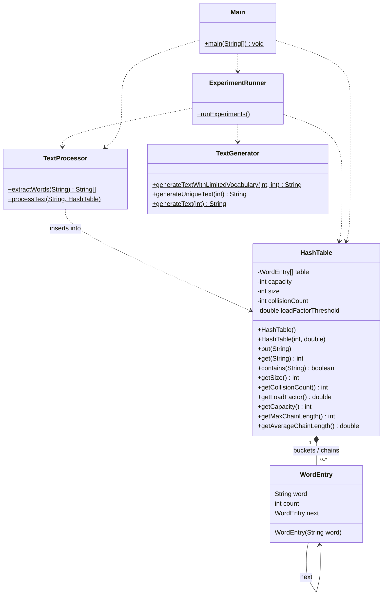

# COMP47500 Assignment 4 — Report

| Field | Value |
|--------|--------|
| **Assignment No.** | 4 |
| **Date** | 09 / 04 / 2026 |
| **Title** | Hashing Word-frequency |
| **Group** | 13 |
| **Student name** | Jiawei Li |
| **Student ID** | 25212461 |
| **Assignment workload** | 100% |
| **Group note** | We do the assignment separately this time. |

---

## 1. Problem domain description

**Domain.** Text analytics and information retrieval often need to know how often each word appears in a document or corpus—for search ranking, readability metrics, plagiarism checks, and building language models.

**Objective.** This project implements a **word-frequency counter**: given raw text, it normalizes tokens, inserts them into a map from word → count, and supports queries such as frequency, membership, and aggregate statistics (unique word count, collisions, load factor, chain lengths).

**Why a hash table.** The core operation is “update or insert count for word *w*” over a stream of tokens. A hash table supports **expected O(1)** insert and lookup under reasonable assumptions, which scales better than scanning a linear list of distinct words for each token. **Separate chaining** is a standard choice when collisions are handled explicitly and when dynamic resizing keeps the load factor bounded. The implementation is a **custom** hash table (not `java.util.HashMap`) to make collision and resizing behaviour observable for the experiments.

---

## 2. Theoretical foundations of the data structure(s) utilised

### 2.1 Hash tables with separate chaining

A **hash table** stores key–value pairs in an array of **buckets**. A **hash function** maps each key to a bucket index. When two distinct keys map to the same bucket, a **collision** occurs.

**Separate chaining** resolves collisions by storing, in each bucket, a **linked list** (or another container) of all keys that hashed to that index. Search inserts by hashing, then scanning the chain for an equal key.

**Average-case complexity** (simple uniform hashing model, load factor α = *n*/*m* keys per bucket): insertion, search, and delete are **O(1 + α)** expected time; with **α** kept constant by resizing, this is **O(1)** expected *Cormen et al., §11.2*.

**Worst case.** If all keys collide in one bucket, operations degrade to **O(n)** (linear list scan).

**Dynamic expansion.** When the number of keys *n* exceeds a threshold relative to capacity *m* (e.g. load factor *n*/*m* > 0.75), the table **doubles** in size and **rehashes** all entries. Amortised over many inserts, resizing contributes **O(1)** amortised cost per insert under typical settings *Cormen et al., §17.4*.

### 2.2 Fit to word-frequency counting

- **Keys** are words (`String`); **values** are integer counts.
- **High locality of reference** in natural text (repeated words) makes **updates** common; hashing to a bucket then updating the head or scanning a short chain is efficient.
- **Chaining** avoids primary clustering issues of open addressing and matches the assignment’s pedagogical goal of observing **chain length** and **collision counts**.

### 2.3 Tree-based alternatives (BST, AVL, red–black)

The same abstract API—**map from key to count**—can be backed by **ordered binary search trees**. A plain **BST** supports `insert`/`search` in **O(h)** time, where *h* is height; for *n* keys, *h* is **O(log n)** only if inserts are sufficiently “random.” **Skewed** insertion orders (sorted keys) degenerate to **O(n)** height, which is unacceptable at scale.

**Balanced trees** (e.g. **AVL**, **red–black**) restore a **logarithmic height guarantee**: operations are **O(log n)** **worst case** per access, with a moderate constant factor and **two or three child pointers** per node plus balance metadata. Java’s `TreeMap` is a red–black tree; it also provides **sorted key order** and **range queries**, which a hash table does not expose without extra structure.

**Strings as keys** add a subtlety: each comparison is **O(L)** in word length *L* (character-by-character in the worst case). A hash table still does **O(L)** work to hash the string, but then bucket access is **O(1)** indexing; the dominant cost after hashing is **chain length**, not log *n* tree depth. So hashing tends to win when:

- **No ordering** of keys is required;
- The **distribution** of keys is benign and **load factor** is controlled;
- **Average-case** throughput matters more than **deterministic** worst-case latency.

Trees become compelling when:

- **Worst-case guarantees** matter (e.g. soft real-time, adversarial or structured key streams);
- **In-order traversal** or **prefix/range** operations on keys are needed;
- **Memory predictability** is easier to reason about without large resize spikes (though trees pay pointer overhead too).

For **word-frequency** specifically, a hash table is the textbook choice for raw throughput; a balanced tree would still be **correct** and would yield **predictable O(log U)** behaviour for *U* distinct words, at the cost of more comparisons per step and no O(1) expectation.

### 2.4 Reference

Cormen, T. H., Leiserson, C. E., Rivest, R. L., & Stein, C. (2022). *Introduction to Algorithms* (4th ed.). MIT Press. (Hash tables, red–black trees, amortised analysis.)

---

## 3. Analysis / design (UML diagrams)

The diagram below reflects the **actual** Java classes, fields, and public/static API used in the submission.



**Design notes.**

- **`WordEntry`** is a singly linked list node: word, count, `next`.
- **`HashTable`** uses `String.hashCode()` masked to a non-negative value, then modulo **current** capacity; new distinct keys in a non-empty bucket increment **`collisionCount`**; load factor **>** threshold triggers **double-and-rehash**; collision count is **not** reset on resize (historical statistic).
- **`TextProcessor`** lowercases text, strips non-alphanumeric characters, splits on whitespace, then calls `put` for each token.
- **`TextGenerator`** builds **deterministic** synthetic corpora (fixed seeds) for reproducible benchmarks.
- **`ExperimentRunner`** runs four experiments and prints metrics to standard output.

---

## 4. Code implementation and GitHub

**GitHub (link):** *[Insert your public repository URL here after pushing this project. The brief asks to add collaborator: [https://github.com/jrgarga](https://github.com/jrgarga).]*

The repository should contain the `src/` Java sources, build instructions (see `README.md`), and a sensible commit history.

**Build and run.**

```bash
cd src
javac *.java
java Main
```

---

## 5. Set of experiments run and results

### 5.1 Experimental setup

| Aspect | Setting |
|--------|---------|
| **Environment** | `java Main` from `src/` after `javac *.java` (single run, no explicit JVM tuning) |
| **Reproducibility** | `TextGenerator` uses deterministic seeds derived from parameters |
| **Default table** | `new HashTable()` → initial capacity **16**, load factor threshold **0.75** (Experiments 1–3) |
| **Experiment 4** | `new HashTable(initialCapacity, 0.75)` with initial capacity ∈ {16, 64, 256, 1024, 4096} |

**Metrics.**

- **Collisions:** incremented when a **new distinct** word is placed in a bucket that already holds a **different** word; repeated `put` for the same word does not increase collisions.
- **Load factor:** `unique keys / current capacity` after all insertions.
- **Max chain length:** longest linked list in any bucket.
- **Avg chain length (Exp. 4):** average length over **non-empty** buckets only.

**Caveat.** Wall-clock and nanosecond timings are **noisy** (JVM warmup, scheduling). Trends matter more than single-run microsecond differences.

### 5.2 Results (sample run — 09 Apr 2026)

#### Demo (short sentence)

Input: `The cat and the dog. The cat is happy.`

| Metric | Value |
|--------|--------|
| Frequency(`the`) | 3 |
| Frequency(`cat`) | 2 |
| Unique words | 6 |
| Collisions | 0 |
| Load factor | 0.3750 |

#### Experiment 1 — Insertion vs growing unique vocabulary

Each row: text is `word0 … word(n−1)` (all distinct), so total tokens = unique words = *n*.

| TotalWords | UniqueWords | Time (ms) | Collisions | Load factor | Max chain |
|------------|---------------|-----------|------------|-------------|-----------|
| 1000 | 1000 | 2.686 | 668 | 0.4883 | 4 |
| 5000 | 5000 | 7.176 | 3630 | 0.6104 | 5 |
| 10000 | 10000 | 8.414 | 6053 | 0.6104 | 5 |
| 20000 | 20000 | 13.299 | 13345 | 0.6104 | 7 |
| 50000 | 50000 | 22.544 | 36815 | 0.3815 | 6 |

**Critical discussion.** Here every token is a **first insertion** of a distinct key, which is the **hardest** regime for hashing: there are no cheap “increment existing key” updates. Wall-clock time grows **sublinearly** in *n* between rows (e.g. 1000→50000 is a 50× key increase but only ~8.4× time in this run), consistent with **near–O(n)** expected work with **periodic doubling** rather than **O(n²)** list scanning.

The **collision counter is cumulative** and is **not** reset when the table resizes. It therefore measures **historical** “distinct key landed in an already non-empty bucket” events, not the **final** number of pairwise clashes in the static table. For large *n*, collisions are on the order of **tens of thousands**: that is not a bug—it reflects that **most** distinct insertions, early in the growth curve, happened while capacity was still small. After rehashing, many of those entries live in **different** buckets than at the moment of collision; the metric answers “how often did chaining trigger during construction?” rather than “how bad is the final layout?”

The **final load factor** (~0.38 for *n* = 50 000) is below 0.75 because the implementation resizes when load **exceeds** the threshold **after** an insert, then doubles until the invariant is restored; the **last** table size can overshoot, leaving a **slack** tail. **Max chain length** staying in single digits supports the claim that **separate chaining with resizing** keeps **search costs bounded in practice** for this workload—though a **pathological** hash could still force one long chain (the same pathological order could also hurt a plain BST; only **balanced** trees remove that risk).

**Contrast with a balanced tree.** Processing *n* distinct inserts in a red–black or AVL map would be **O(n log n)** comparisons in the worst case, each comparison **O(|word|)** for strings. There would be **no** “collision count” analogue, but **height** (~log *n*) replaces **chain length** as the structural stress metric. For *n* = 50 000, log₂ *n* ≈ 15—small—but every operation pays that depth **deterministically**, whereas hashing pays **expected** O(1) bucket access plus **short** chains under this experiment’s benign `word*i` keys.

#### Experiment 2 — Fixed 50 000 tokens, varying vocabulary size

| Total | Vocab size | Actual unique | Collisions | Load factor | Time (ms) | Max chain |
|-------|------------|---------------|------------|---------------|-----------|-----------|
| 50000 | 10 | 10 | 0 | 0.6250 | 6.188 | 1 |
| 50000 | 100 | 100 | 56 | 0.3906 | 5.241 | 2 |
| 50000 | 1000 | 1000 | 671 | 0.4883 | 5.937 | 4 |
| 50000 | 5000 | 5000 | 3475 | 0.6104 | 6.124 | 5 |
| 50000 | 10000 | 9944 | 5978 | 0.6069 | 6.542 | 5 |

**Critical discussion.** This experiment **isolates repetition**: total work (50 000 `put`s) is **fixed**, while the **effective cardinality** of the stream changes. The **10-word** case is instructive: after the table holds ten keys, **every subsequent token is an update**, so **no further collisions** occur and chains need not grow beyond one entry per occupied bucket (here max chain 1). That shows **why hash tables dominate NLP-style streaming counts**—language is **Zipf-heavy**: a small core vocabulary absorbs most tokens.

As vocabulary rises, **first-seen** events remain frequent enough that collision totals approach those in Experiment 1-style growth (compare 10 000 vocabulary / 9 944 unique with ~6 000 collisions). The slight shortfall of **actual unique** vs **10 000** vocabulary (9 944) is **sampling noise** from the deterministic RNG: not every label in `0…9999` appeared in 50 000 draws. **Time** does **not** scale with vocabulary in this table: all rows are ~6 ms because **CPU work is dominated by 50 000 insert paths**, not by final table size alone—an important correction to the intuition that “bigger dictionary ⇒ proportionally slower run,” which would hold more clearly if we measured **per-insert** cost after the structure is huge.

**Trees on the same workload.** A `TreeMap` would still perform **50 000** map updates, each **O(log U)** for *U* distinct keys present at that moment. For *U* = 10, that is trivial; for *U* ≈ 10 000, depth is modest but **every** token pays logarithmic work, whereas hashing pays **O(1)** expected bucket access and mostly **O(1)** updates once the key is hot. Hashing’s advantage is **aggregate** throughput on repetitive streams; a tree would win if we needed **alphabetical listing of counts** without copying keys to an array.

#### Experiment 3 — Lookup performance by query type

Dataset: 20 000 unique words plus an extra block biased toward `word0`–`word4`. Each category: **50 000** `get` calls cycling over five words.

| Category | Avg lookup time (ns) |
|----------|----------------------|
| Existing frequent | 33.70 |
| Existing rare | 15.55 |
| Missing | 5.32 |

**Critical discussion.** These numbers should be read **skeptically**: `System.nanoTime()` around a tight loop is vulnerable to **JIT inlining**, **dead-code elimination** (mitigated here by accumulating into `sink`), **CPU frequency scaling**, and **branch prediction**. The ranking **frequent > rare > missing** is **not** what a naive “hot keys sit at the front of the chain” story predicts, because this implementation **prepends** new keys but **never moves** existing nodes on repeat `put`. A key that collided early can remain **deep** in its chain regardless of later popularity. Thus **high frequency does not imply low probe length** in this design—an important **design critique**.

Why might **missing** look fastest? For these five synthetic missing strings, several effects may combine: they may land in buckets with **shorter** chains than the average, **negative lookups** may take a **predictable** branch path the CPU learns, or the **five missing strings** may disproportionately hit **empty** slots (hash modulo capacity distributes keys; absent keys are not guaranteed to mirror the occupancy of existing keys). **Conclusion:** this micro-benchmark is useful for **course discussion**, not for claiming general lookup ordering. A fair comparison to **tree lookup** would hold string lengths and key sets fixed and use a proper harness; asymptotically, **expected** hash lookup is **O(1 + α)** vs **O(log n)** for balanced trees, but **constants** and **cache effects** decide microsecond races.

#### Experiment 4 — Initial capacity (same text: 50 000 tokens, vocab 20 000)

| Init cap | Final cap | Collisions | Load factor | Time (ms) | Avg chain | Max chain |
|----------|-----------|------------|-------------|-----------|-----------|-----------|
| 16 | 32768 | 12202 | 0.5624 | 7.013 | 2.272 | 7 |
| 64 | 32768 | 12197 | 0.5624 | 7.082 | 2.272 | 7 |
| 256 | 32768 | 12173 | 0.5624 | 6.869 | 2.272 | 7 |
| 1024 | 32768 | 12098 | 0.5624 | 7.495 | 2.272 | 7 |
| 4096 | 32768 | 11694 | 0.5624 | 7.461 | 2.272 | 7 |

**Critical discussion.** The striking pattern is **identical final capacity, nearly identical final load factor, and identical avg/max chain statistics** across initial capacities, while **collision counts still differ** by hundreds. That is exactly what the implementation’s semantics imply: **rehashing** rebuilds the table into a **new** address space; **final** chain statistics reflect the **last** array and hash modulo **final** *m*, not the **history** of clashes when *m* was 16 or 64. The collision counter is therefore a **stress trace of the growth path**, not a proxy for **final search cost**.

Larger **initial capacity** reduces collisions during the **first few thousand** inserts when the load factor would otherwise spike quickly; those avoided events **lower the cumulative counter** even when the end state matches. **Wall-clock time** shows **no reliable win** here: total work is still **Θ(N)** insertions with the **same** sequence of resizes from the point where both tables reach the same size, and **rehash costs** dominate comparably. In other words, **tuning initial capacity** bought a **cleaner growth log** (fewer historical collisions) but **not** a measurably different asymptotic story in this single run—**memory** was paid earlier (larger array from the start) for a **slightly less collision-heavy** childhood.

**Comparison to trees.** Initial “capacity” in a tree is not analogous: growth is **node-by-node**; there is no **global rehash**. A balanced tree’s **rebalancing** work is **O(1)** amortised or **O(log n)** per insert depending on the variant, but spread across **local** rotations rather than one **bulk** rebuild. Hash tables **batch** relocation at resize, causing **latency spikes** that trees avoid in exchange for **per-step** restructuring costs.

### 5.3 Synthesis: what the experiments jointly show

1. **Metric hygiene.** “Collisions” in this codebase measure **events during insertion history**; **max/avg chain** measure **post hoc structure**. Interpreting them as one quantity would **overstate** or **understate** perceived quality. For reporting, pairing **final load factor + max chain** with **insertion time** is closer to user-visible performance than raw collision totals alone.

2. **Workload sensitivity.** Hash tables shine when **repetition** is high (Experiment 2, small vocabulary). Pure distinct-key streams (Experiment 1) are the **least flattering** regime but still behave **well** in practice here because resizing keeps α bounded.

3. **Trees as a methodological baseline.** Without implementing `TreeMap` side-by-side, we can still argue from complexity: for *U* distinct words and *N* tokens, a hash table achieves **Θ(N)** expected time with **O(U)** space under simple uniform hashing; a balanced BST achieves **Θ(N log U)** **worst-case** time with comparable **Θ(U)** space. The **log U** factor is modest for *U* ≈ 10⁴ but matters at **very large** *U* and tight latency SLAs; **hashing** trades **probabilistic** assumptions for **raw speed**.

4. **Limits of the evidence.** One JVM run, synthetic `word*k` keys, and `String.hashCode()` as shipped are **not** a security or robustness study. **Adversarial** key sets can **force** long chains or **HashDoS**-style behaviour unless **randomised** hashing or **balanced** fallbacks are used—domains where **tree-based** maps or **safe** library hash maps are deliberately chosen.

---

## 6. Comments (design decisions, challenges, limitations)

**Design decisions.**

- **Prepend** new entries to the chain for **O(1)** insertion after the scan that confirms the word is absent.
- **Collision count** only on **first insertion** of a distinct key into a non-empty bucket, matching the assignment’s emphasis on distinct-key collisions.
- **Resize** doubles capacity when **load factor > threshold** (strict inequality as implemented after insert).

**Challenges.**

- Balancing a **clear** collision definition with **resize**: rehashing does not add to `collisionCount`, so the counter reflects **insertion-era** collisions rather than “current structure” collisions.

**Limitations.**

- **Hash function** is Java’s `String.hashCode()`; it is not cryptographically strong and need not be “best” for adversarial inputs.
- **Benchmarks** are informal; production-grade evaluation would warm the JVM and aggregate many runs.
- **Memory:** chaining uses extra pointers per distinct word compared to open addressing (trade-off: simpler deletion model and no clustering).

**Possible improvements.**

- Add optional **warmup** loops and repeated trials with mean/median reporting.
- Parameterise **threshold** and **initial capacity** from the command line for sweeps.
- Implement a **parallel** driver using `TreeMap` (or a small AVL from a prior assignment) on **identical** token streams to **empirically** contrast constants, not only big-O.
- Consider **move-to-front** or **self-organising** chains if **skewed** access patterns should drive **lower** average probe length for hot keys.

**Broader takeaway.** The hash table is the right **engineering** default for word counts; **balanced trees** remain the right **theoretical** reference point for **worst-case** guarantees and **ordered** views of the keyspace. The experiments support that distinction more than they “prove” raw speed superiority—**interpretation** must separate **historical collision counts**, **final structure**, and **microbenchmark noise**.

---

## 7. Video of the implementation running

**Zoom (link & password):** *[Record a short walkthrough: run `java Main`, show demo output, scroll through experiment tables, and briefly explain collision count and load factor. Per the brief, avoid a silent-only recording.]*

**Comments:** *[After recording, paste the share link and any password here.]*

---

## 8. Submission note

Save this report (or export from Markdown to PDF) and submit on **Brightspace** as required. Group members should submit the **same** file where applicable.
